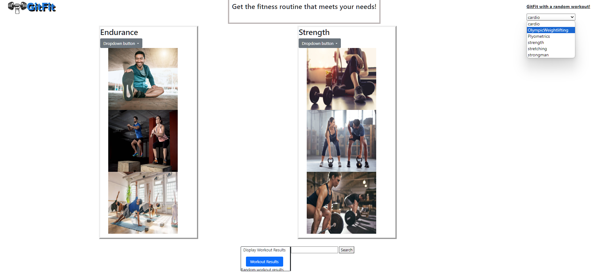

# Project1-Grp3
Project 1-Buid a website that uses css, html, and javascript.
## User story
As a user I would like to go to a webpage to search for a variety of wokrout and instructions to help guide me along and meet my fitness goals based on the parts of the body I would like to target.

## Picture of Live website

#### Description:
    Front page of website showing without any functionality used. This is what the user sees when the page is loaded. The user can then select options from the selection of "random workout button", "endurance", "strength", or "endurance & strength". The User can then click the button of ==Workout-Results==

## Picture of Endurance button results

#### Description:
    Page loading the endurance tab showing the selection of the drop fown menu. The user can then select which items intrigue them and then the results are then displayed in a results section as can be seen at the bottom of the page.
## Picture os strength workout button

#### Description:
    Page loading the strength tab showing the selection of the drop fown menu. The user can then select which items intrigue them and then the results are then displayed in a results section as can be seen at the bottom of the page.
## Picture of random WorkOut button

#### Description:
   Page loading the "random workout button" tab showing the selection of the drop down menu. The user can then select which items intrigue them and then the results are then displayed in a results section as can be seen at the bottom of the page.
## Deployed Website Link
### link: 
http://127.0.0.1:5501/Project1-Grp3/index.html